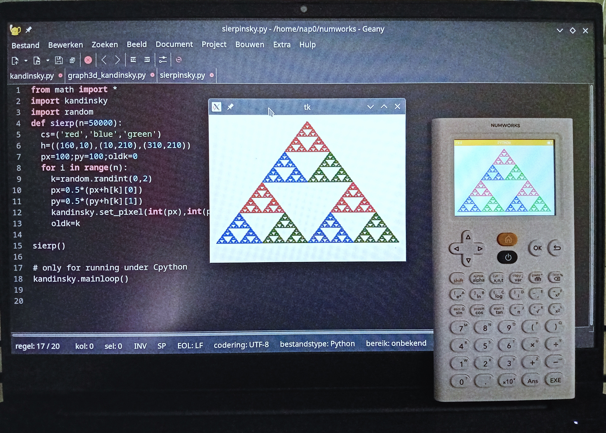

# kandinsky.py
Allows to run Python code for the Numworks calculator that uses the kandinsky module to run in CPython
This example shows the same Python code that draws a Sierpinsky triangle both in CPython on a laptop and on the Numworks calculator.

The only modification of the Numworks python code required is to add the following to the end of the code:

    # only for running under Cpython
    kandinsky.mainloop()

By placing the file kandinsky.py in the same folder as the Numworks Python code, 
the import statement in the Numworks code automatically imports kandinsky.py
